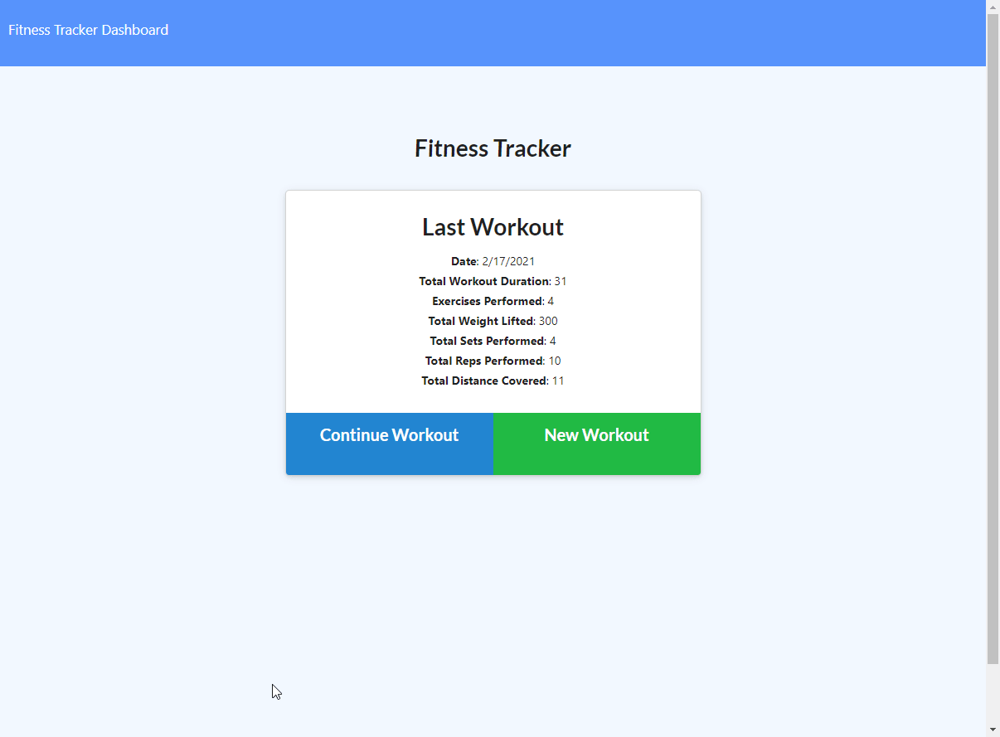
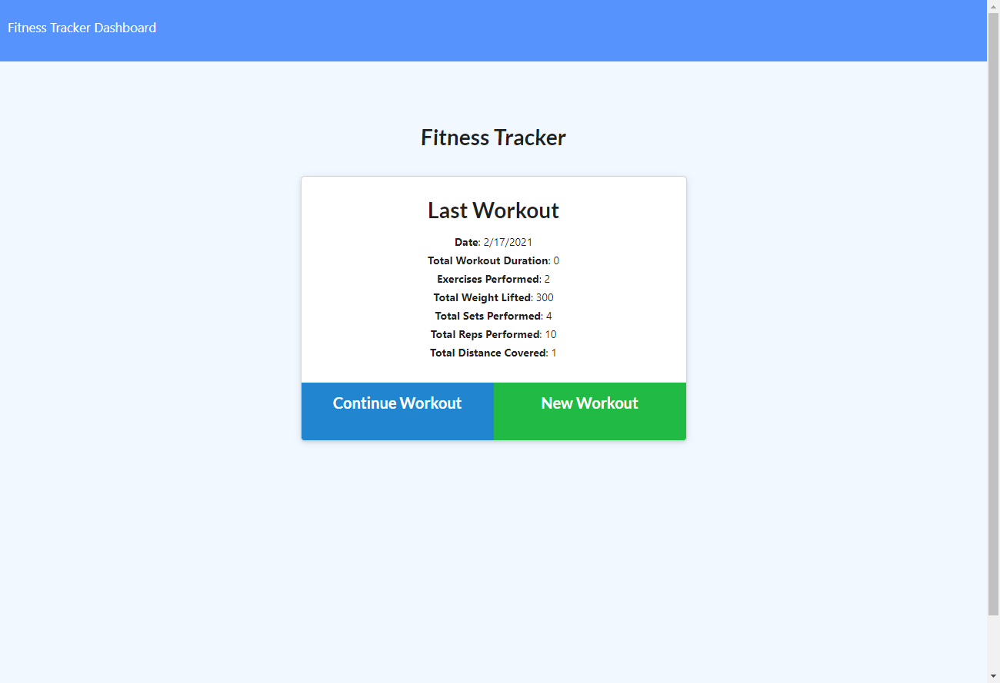
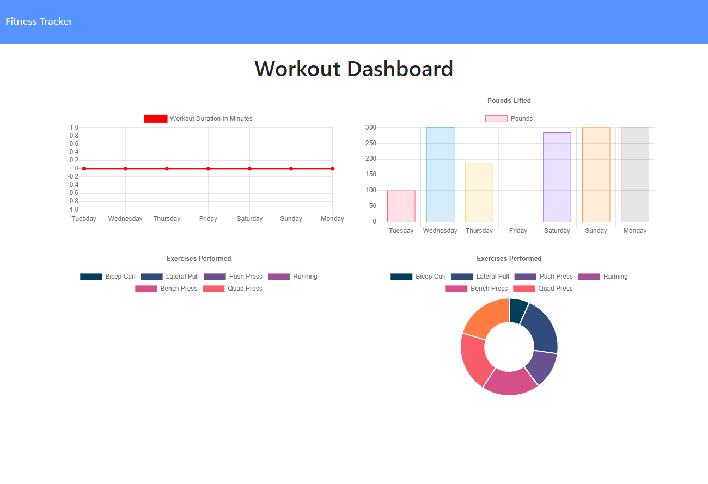

# Fit-or-Bust  [](https://opensource.org/licenses/MIT) 
This readme has been procedurally generated 

-----------------------
## Table of Contents
1. [Description](#description)
2. [Deployed link](#deployed-link)
3. [Installation](#installation)
4. [Usage](#usage)
5. [Code snippets](#code-snippets)
6. [Licenses](#licenses)
7. [Contributing](#contributing)
8. [Tests](#tests)
9. [Questions](#questions)

-----------------------
## Description
Fitness tracker for those looking to strengthen themselves to fight in the upcoming gladiatorial arena. Prospective fighters can keep track of resistance or cardio training. This app is not for the weak of will.



-----------------------
## Deployed link
https://fit-or-bust.herokuapp.com/

-----------------------
## Installation
To install dependencies run the following command:
```
npm install
```

-----------------------
## Usage
To use this repo you will need a working knowledge of MongoDB, Javascript. 

To run this tool use the following command. 

```
node server.js
```
-----------------------
## Code snippets
Without creating an additional MongoDB field to track the total duration of a users workout, to get the total duration of a workout, we use the following **GET** route with the aggregate command. With aggregate, we call on its $addFields function that will add all of the specified members of a table and store it in a designated variable. In this case we want to sum the duration of all exercises associated with a workout and store it in `totalDuration`.

```javascript
router.get("/api/workouts", (req, res) => {
	Workout.aggregate([
		{
			$addFields: {
				totalDuration: { $sum: "$exercises.duration" }
			}
		}
	])
	// .sort({ day: 1 })
	.then(dbWorkout => {
		res.json(dbWorkout);
	})
	.catch(err => {
		res.status(400).json(err);
	});
});
```



For the chart dashboard, we only care to display the last 7 days of the users workout history. We call `find({}).limit(7)` to limit the data being used to the last 7 items in the data. 

```javascript
router.get("/api/workouts/range", (req, res) => {
	Workout.find({}).limit(7)
		.then(data => {
			res.json(data);
		})
		.catch(err => {
			res.json(err);
		});
});
```



-----------------------
## Licenses
This project uses a [MIT License](https://opensource.org/licenses/MIT). 

-----------------------
## Contributing
If you would like to contribute, you will need to know MongoDB, Javascript, Routing.

-----------------------
## Tests
To run tests run the following command:
```
NA
```

-----------------------
## Questions
Created by Muhammad A Khalid

If you have any questions you can reach me at the following email: [akhalid.code@gmail.com](mailto:akhalid.code@gmail.com)

Follow my other work at GitHub: https://github.com/akhalid.88/
